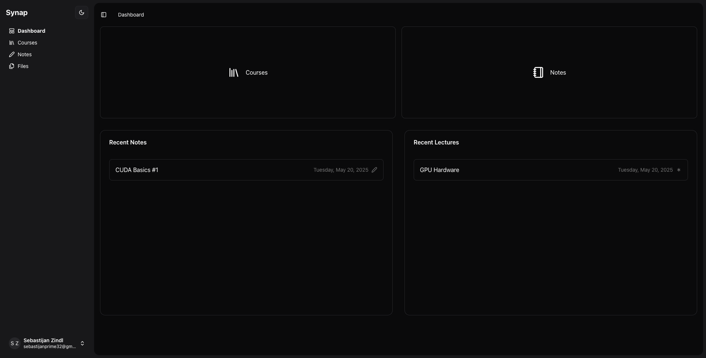
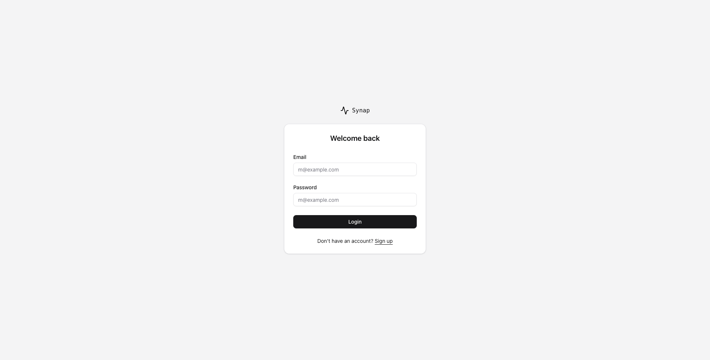
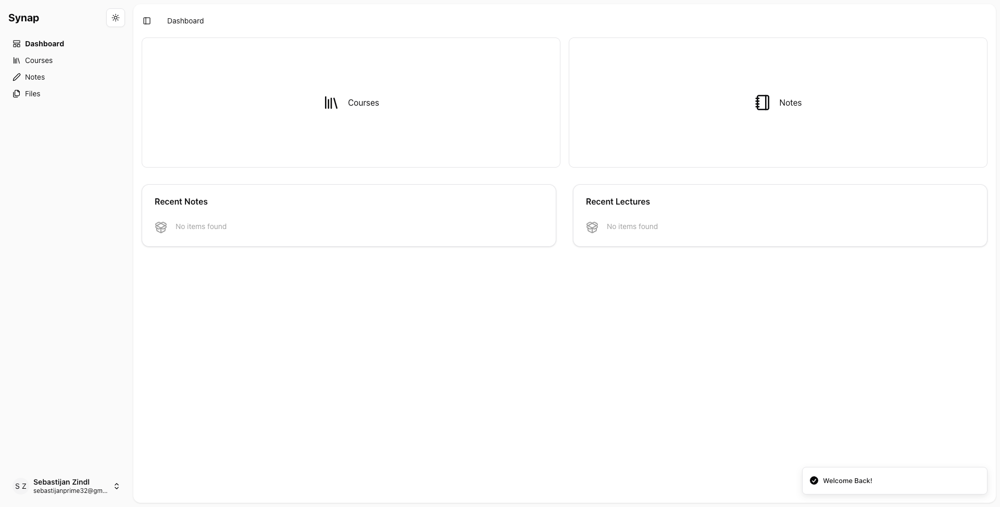
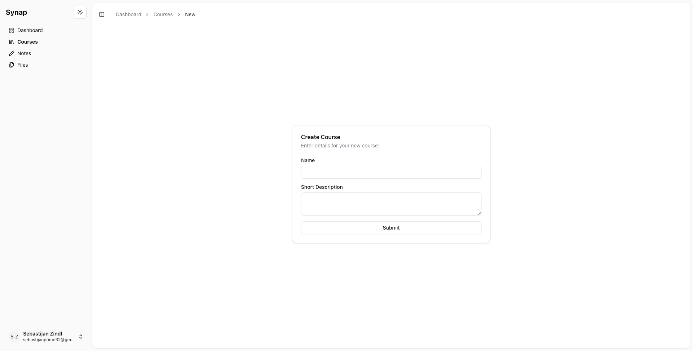
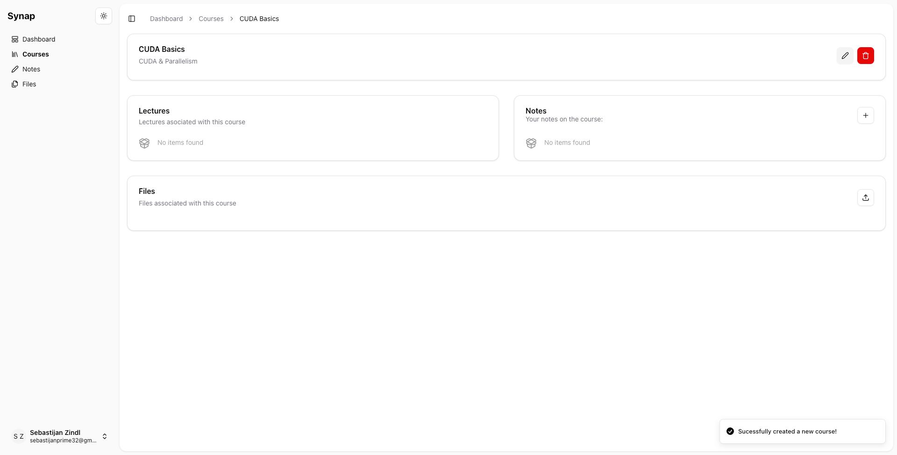
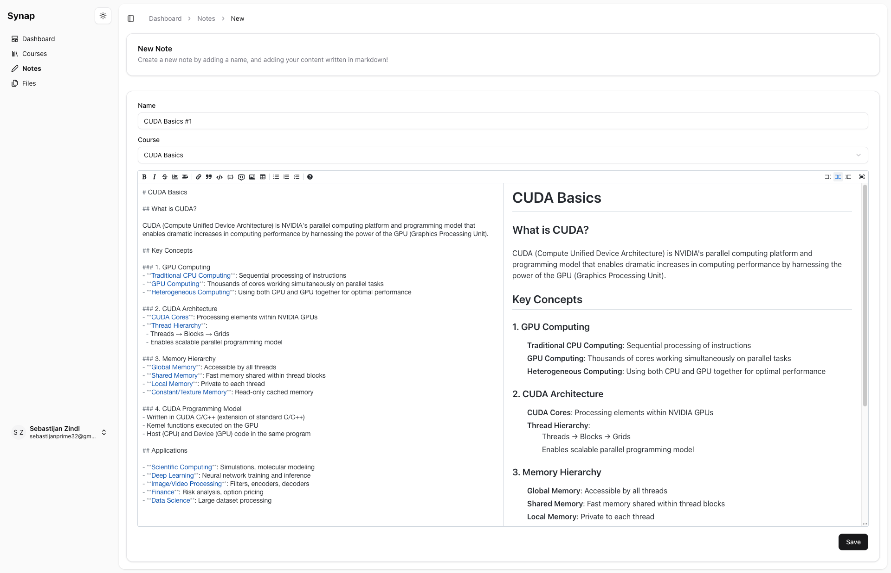
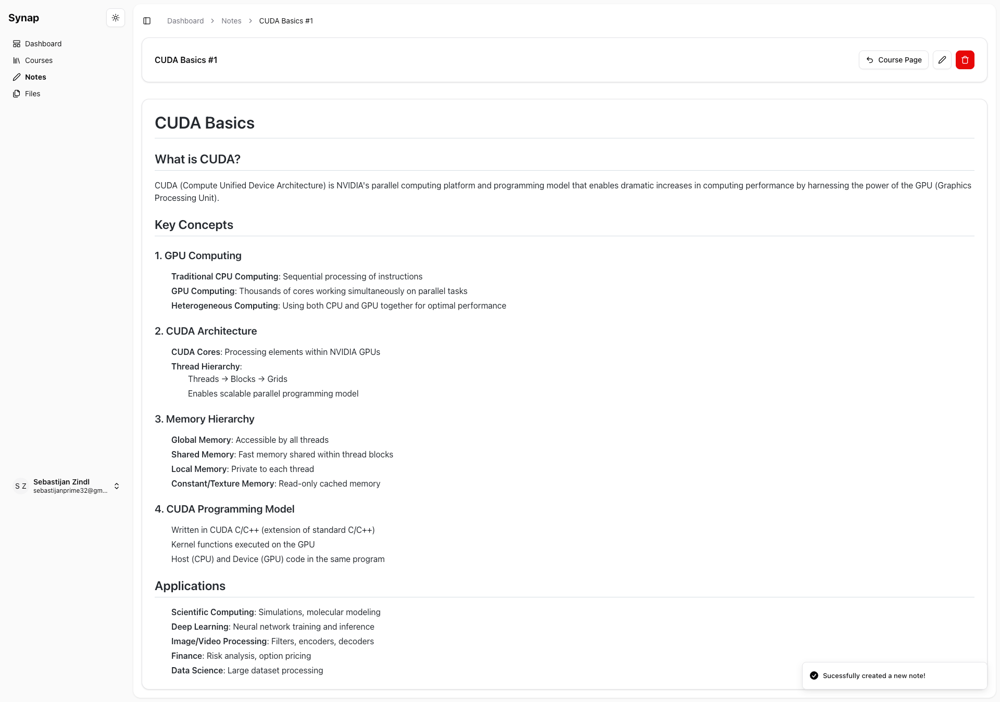
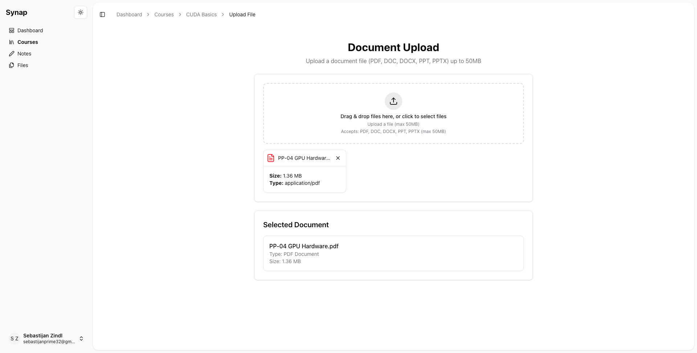
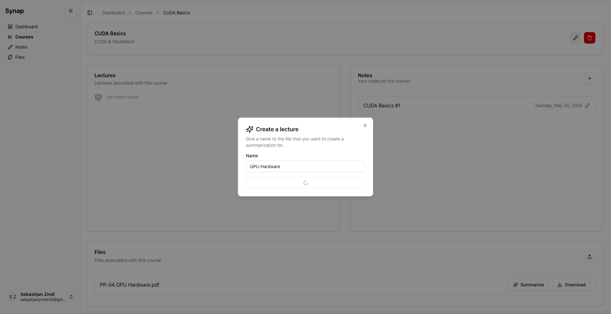
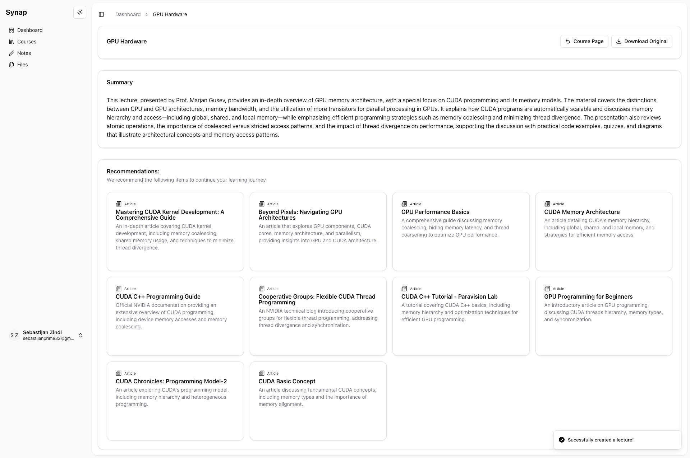

# Synap

A smart content summarization tool made for students.

## Overview

Synap is an AI-driven online learning platform designed to assist users, primarily students, in their learning journey. It efficiently extracts key insights from extensive texts, aiming to enhance productivity, comprehension, and information retention. The platform allows users to upload materials, receive distilled summaries, explore topics in detail, and test their understanding.

The main goal of Synap is to deliver a student-first AI-driven online learning platform that eases the journey and pain points of every student. The platform is intended to be self-hostable or usable as a provided service.

## Key Features

Synap offers a range of functionalities to support a comprehensive learning experience:

- **User Management:**
  - Secure sign-up with email and password authentication, including email verification and password strength validation.
  - Sign-in functionality and password recovery via email.
  - Users can update their profile information and delete their accounts.
- **Course Management:**
  - Create, edit, and delete personal courses.
  - Upload, rename, and delete lecture files (supports PDF, DOC, DOCX, TXT, PPTX).
  - Organize files within their respective courses and view all associated courses on a dashboard.
- **Content Summarization:**
  - Automatic generation of summaries for uploaded lecture materials.
  - Text extraction from various document formats.
  - Toggle between the generated summary and the original content without downloading files.
- **Learning Material Recommendations:**
  - Analyzes summarized content to identify key topics and concepts.
  - Recommends relevant external materials (videos & articles) with direct links, prioritized by relevance and quality.
- **Note-Taking Functionality:**
  - Create, edit, and delete personal notes associated with a selected course or a specific lecture.
  - Timestamps for note creation and modification are maintained.

## Technologies Used

- **Backend:** FastAPI + Alembic + SQLAlchemy
- **Frontend:** React with Tanstack Router
- **AI:** OpenAI Models (gpt-4.1 & gpt-4o-search-preview)
- **Storage** S3 for File & Blob Storage
- **Database** PostgreSQL
- **Communication Protocol:** HTTPS for secure data transfer

## Screenshots












## Non-Functional Highlights

- **Performance:** Designed to support at least 1000 concurrent users with page load times under 5 seconds. File summarization for files under 35MB is aimed to be within 5 minutes.
- **Reliability:** Aims for 99.5% uptime with daily data backups.
- **Security & Privacy:** Implements secure password hashing, compliance with data protection regulations, protection against common web vulnerabilities, and encrypted data transmission using HTTPS.
- **Usability:** Features a user-friendly and intuitive interface.
- **Scalability:** Built with an architecture that supports horizontal scaling.
- **Compatibility:** Works on all major web browsers and is responsive across different screen sizes. Supports common academic file formats.

## Project Setup

If you want to run the project with docker:

```bash
docker compose up -d --build
```

### Frontend

Make sure to have `pnpm` installed.

1. Create a .env file

```bash
# /frontend
cp .env.example .env
```

2. Install dependencies

```bash
# /frontend
pnpm install
```

3. Run the project

```bash
# /frontend
pnpm run start --port <desired_port>
```

### Backend

To run this project locally the recommended python version is `3.10`

1. Setup a virtual environment

```bash
# /backend
python -m venv .venv
```

2. Install depndencies

```bash
# /backend
pip install -r requirements.txt
#or
uv pip install -r requirements.txt
```

3. Create .env files

```bash
# /backend
cp .env.example .env.local # - for a development profile

cp .env.example .env # - for a production profile
```

4. Run the project

```bash
# /backend
chmod +x ./scripts/start.sh
./scripts/start.sh
```
